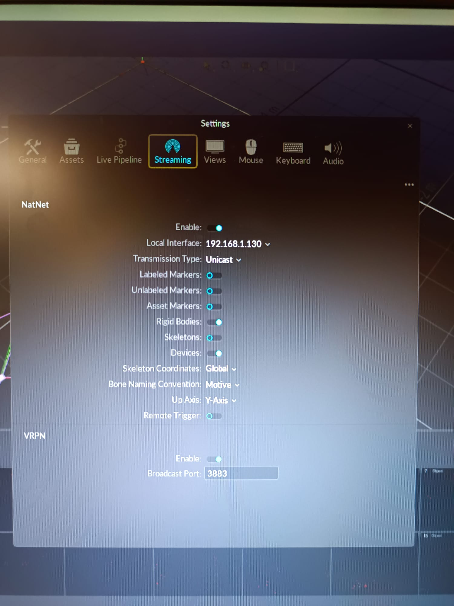
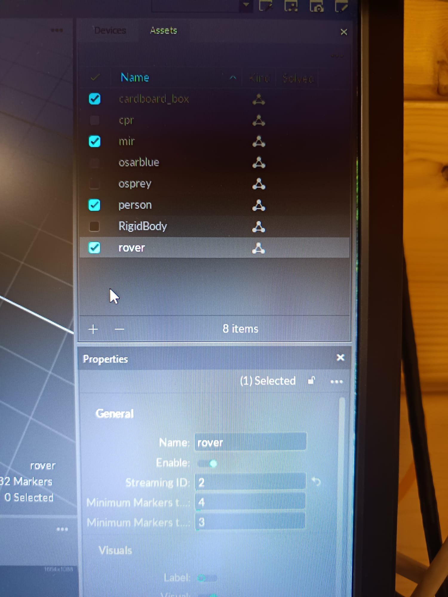

# OptiTrack ROS 2 Driver (Docker)

Pre-built Docker image for streaming OptiTrack motion capture data into ROS 2 Humble topics.

## What this does

Runs the [mocap4r2 OptiTrack driver](https://github.com/MOCAP4ROS2-Project/mocap4ros2_optitrack) inside a Docker container. Once started, it connects to the OptiTrack Motive software and publishes data on two ROS 2 topics:

| Topic | Message type | Content |
|-------|-------------|---------|
/rigid_bodies` | `mocap4r2_msgs/msg/RigidBodies` | Pose (position + orientation) of each rigid body |
| `/rigid_body_<id>/pose` | `geometry_msgs/msg/PoseStamped` | Individual rigid body pose for a given ID (created when `RIGID_BODY_IDS` is set) |
| `/markers` | `mocap4r2_msgs/msg/Markers` | Individual marker positions |

## Prerequisites

- **Docker** installed on your machine ([install guide](https://docs.docker.com/engine/install/ubuntu/))
- **ROS 2 Humble** installed on your machine ([install guide](https://docs.ros.org/en/humble/Installation/Ubuntu-Install-Debs.html))
- Your computer must be on the **same network** as the OptiTrack system (connected via Ethernet to the OptiTrack switch)
- Connect your laptop to the Wi-Fi network `asta_optitrack` using the password `asta2020` (this network is used to reach the OptiTrack Motive PC).

### Install Docker (if you don't have it)

```bash
# Install Docker
sudo apt-get update
sudo apt-get install -y docker.io

# Allow running Docker without sudo
sudo usermod -aG docker $USER

# Log out and log back in for the group change to take effect
```

## Quick start

### Step 1: Pull the Docker image

```bash
sudo docker pull vvipu/mocap4r2_optitrack
```

### Step 2: Find your computer's IP address

Your computer needs to be connected to the OptiTrack network. Find your IP on that network:

```bash
ip addr show
```

Look for the IP on the same subnet as the OptiTrack server (typically `192.168.1.x`).

### Step 3: Run the container

```bash
sudo docker run --rm --network host \
  -e SERVER_IP=192.168.1.130 \
  -e LOCAL_IP=<YOUR_IP> \
  -e RIGID_BODY_IDS=1,4 \
  vvipu/mocap4r2_optitrack
```

Replace `<YOUR_IP>` with the IP you found in Step 2.

**Example:**
```bash
sudo docker run --rm --network host \
  -e SERVER_IP=192.168.1.130 \
  -e LOCAL_IP=192.168.1.194 \
  -e RIGID_BODY_IDS=1,4 \
  vvipu/mocap4r2_optitrack
```

You should see output like:
```
Starting OptiTrack driver with:
  SERVER_IP=192.168.1.130
  LOCAL_IP=192.168.1.194
  CONNECTION_TYPE=Unicast
...
[INFO] ... connected!
[INFO] ... Application: Motive (ver. 3.0.3.1)
[INFO] ... Configured!
Activating node...
Node activated — publishing on /rigid_bodies and /markers
```

### Step 4: Read the data

Open a **new terminal** and source your ROS 2 workspace that has `mocap4r2_msgs`:

```bash
source /opt/ros/humble/setup.bash
source ~/mocap4r2_ws/install/setup.bash
```

Then read the rigid body poses:

```bash
ros2 topic echo /rigid_bodies
```

Or read individual markers:

```bash
ros2 topic echo /markers
```

If you provided `RIGID_BODY_IDS` when starting the container, the driver will create individual pose topics for each rigid body ID in the form `rigid_body_<id>/pose`.

Example: to echo the pose for rigid body `1`:

```bash
ros2 topic echo /rigid_body_1/pose
```

### Step 5: Stop the container

Press `Ctrl+C` in the terminal where the container is running.

## Configuration

All configuration is done through environment variables passed with `-e`:

| Variable | Default | Description |
|----------|---------|-------------|
| `SERVER_IP` | `192.168.1.130` | IP address of the OptiTrack Motive PC |
| `LOCAL_IP` | `0.0.0.0` | IP address of your computer on the OptiTrack network |
| `CONNECTION_TYPE` | `Unicast` | `Unicast` or `Multicast` |
| `RIGID_BODY_IDS` | `` | Comma-separated list of rigid body IDs to publish individually (e.g. `1,4`) |

## Images

### OptiTrack configuration



OptiTrack configuration to work with the current setup. In this picture the up-axis is set to **Y**, but you may set it to **Z** depending on your Motive/project preferences.

### Rigid body example



Define a rigid body and give it an ID that does *not* match other existing IDs in the scene; that ID is the one you can pass via the `RIGID_BODY_IDS` environment variable (comma-separated) so the driver will create the per-body topic `rigid_body_<id>/pose` for it.

## Troubleshooting

### Verify data inside the container

If you're not sure whether the problem is on the host or inside the container, you can open a shell inside the running container to check directly. First, find the container ID:

```bash
docker ps
```

Then open a bash session inside it:

```bash
docker exec -it <CONTAINER_ID> bash
```

Once inside, source the workspace and check the topics:

```bash
source /opt/ros/humble/setup.bash
source /ws/install/setup.bash
ros2 topic list
ros2 topic echo /rigid_bodies --once
```

If you see data here but not on your host, the issue is DDS communication between the container and your machine (make sure you used `--network host` when starting the container).

Press `Ctrl+D` to exit the container shell.

### "Cannot see topics or messages"

Make sure you have `mocap4r2_msgs` built and sourced on your host machine. Without the message definitions, `ros2 topic echo` cannot decode the messages. If you don't have the workspace:

```bash
mkdir -p ~/mocap4r2_ws/src && cd ~/mocap4r2_ws/src
git clone https://github.com/MOCAP4ROS2-Project/mocap4r2_msgs.git
cd ~/mocap4r2_ws
source /opt/ros/humble/setup.bash
colcon build --packages-select mocap4r2_msgs
source install/setup.bash
```

### "Connection refused" or "Cannot connect to Optitrack"

- Check that Motive is running on the OptiTrack PC
- Check that your computer is on the same network (ping the server: `ping 192.168.1.130`)
- Make sure the `SERVER_IP` and `LOCAL_IP` are correct

### "Docker permission denied"

```bash
sudo usermod -aG docker $USER
# Then log out and log back in
```

### "Image not found" when pulling

Make sure you typed the image name correctly:
```bash
docker pull vvipu/mocap4r2_optitrack
```

## Lab defaults

- **OptiTrack Server IP**: `192.168.1.130`
- **Motive version**: 3.0.3.1
- **NatNet version**: 4.0.0.0
- **Frame rate**: 120 Hz

## Building the image locally (maintainers only)

If you need to rebuild the image:

```bash
cd ~/mocap4r2_ws
docker build -t vvipu/mocap4r2_optitrack .
docker push vvipu/mocap4r2_optitrack
```
